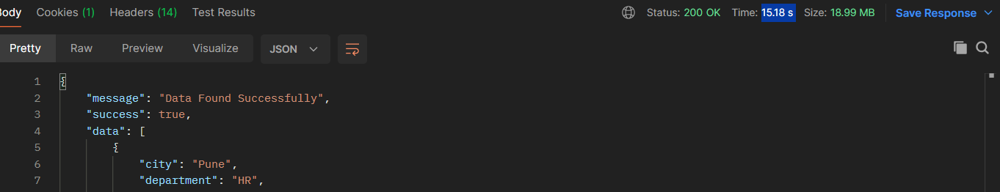
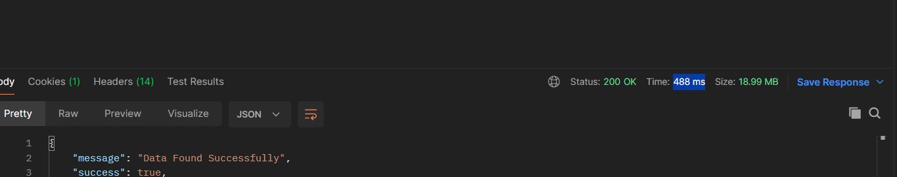

## Spring Boot User Management API

This project demonstrates a fully functional Spring Boot application with modern best practices and essential features for building scalable RESTful APIs.

---

## Features

### Authentication & Security
- JWT-based authentication and authorization
- Spring Security integration
- Secure endpoints with role-based access (optional extension)

### User Management
- Create, retrieve, update, and delete users
- List all users (pagination can be added)

### Database Integration
- JPA / Hibernate for ORM
- Compatible with MySQL (or any supported relational database)
- Clean entity and repository structure

### REST API Design
- Well-structured RESTful endpoints
- Consistent API response format:

{
"message": "Operation successful",
"success": true,
"data": {}
}

### Error Handling
- Global exception handling using @ControllerAdvice
- Custom error responses for better debugging and user experience

### Code Optimization
- Lombok integration to reduce boilerplate code
    - Getters / Setters
    - Constructors
    - Builder pattern (optional)

### Health Monitoring
- Spring Boot Actuator integration
- Health Check API available
- Styled using Thymeleaf (optional UI view)

---

## Tech Stack

- Java 17
- Spring Boot
- Spring Security
- JWT (JSON Web Token)
- Spring Data JPA / Hibernate
- MySQL (or compatible DB)
- Lombok
- Thymeleaf (for health check UI)

---

## Project Structure

src/
├── controller
├── service
├── repository
├── entity
├── dto
├── security
├── exception
└── config

---

## Setup Instructions

1. Clone the repository  
   git clone <your-repo-url>

2. Configure database in application.properties or application.yml

3. Run the application  
   mvn spring-boot:run

4. Access APIs at  
5. For Example HealthCheck API endpoint is
 ## https://springboot-crud-users-api.onrender.com/api/healthcheck
This may take some time as Render takes 30-40 seconds to restart service

---

## Redis Implementaion
Implemented Redis caching in the application to optimize API response times for a dataset of 100,000 records.

Before implementing Redis:

The API response time was approximately 9–15 seconds.

After implementing Redis:
The API response time was reduced to 488 ms.

## Performance Comparison

| Metric | Before Redis | After Redis |
|--------|-------------:|------------:|
| Response Time | 9–10 seconds | 488 ms |
| Improvement | — | **~95% faster** |

# Memurai Redis Commands Used
Useful Memurai Redis CLI commands used for checking Redis status, debugging cache, and managing stored data.

| No. | Command | Purpose |
|---|---|---|
| 1 | `sc query Memurai` | Check Memurai Redis service is running |
| 2 | `netstat -ano \| findstr :6379` | Check Redis is running on port 6379 |
| 3 | `memurai-cli ping` | Test Redis connection |
| 4 | `memurai-cli keys *` | View all Redis keys stored |
| 5 | `memurai-cli dbsize` | Check total number of keys in Redis database |
| 6 | `memurai-cli get "employee::1"` | View cached Employee data from Redis |
| 7 | `memurai-cli flushall` | Clear all Redis cache/data |

## Future Enhancements (Optional)

- Role-based authorization (Admin/User)
- Swagger API documentation
- Pagination & sorting
- Docker support
- CI/CD pipeline integration

---

## Contribution

Feel free to fork this repository and contribute improvements!